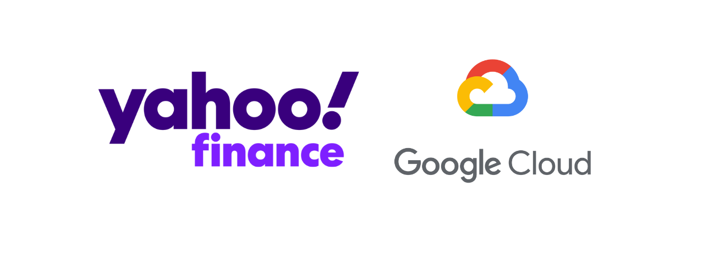
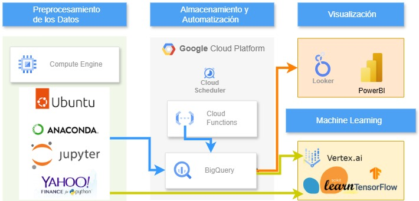

# Proyecto de Asesor Financiero - GCP

Este proyecto en Google Cloud Platform (GCP) permite analizar datos financieros en tiempo real de empresas del índice NASDAQ-100. La solución emplea infraestructura en la nube para la ingesta, almacenamiento y análisis de datos para extraer insights financieros.

## Objetivo

El sistema está diseñado para procesar y analizar datos bursátiles históricos y en tiempo real de manera eficiente. Sus funcionalidades clave incluyen:

- **Ingesta de datos** sobre la capitalización bursátil de empresas.
- **Almacenamiento y consulta rápida** en BigQuery.
- **Visualización de datos** mediante Power BI y Looker Studio, facilitando reportes y gráficos dinámicos.

## Tecnologías Utilizadas

Para crear una arquitectura escalable y automatizada en la nube, se utilizan:

- **Compute Engine (VM):** Para el procesamiento inicial y la ingesta de datos.
- **BigQuery:** Para almacenar grandes volúmenes de datos y realizar consultas eficientes.
- **Python y YFinance:** Para la extracción y procesamiento de datos financieros.
- **SQL:** Para consultas en BigQuery.
- **Cloud Functions:** Para la actualización diaria automática de datos.
- **Looker Studio y Power BI:** Para visualización y generación de reportes.

## Guía de Instalación

### 1. Configuración de la Máquina Virtual (VM)
   - Crea una VM en Compute Engine de Google Cloud.
   - Instala Python y las librerías necesarias como `yfinance`, `pandas`, `BeautifulSoup`, y `Anaconda` para extracción de datos históricos mediante web scraping.

### 2. Conexión con BigQuery
   - Configura la VM para conectarse a BigQuery como base de datos principal.
   - Asegúrate de usar una Cuenta de Servicio con los permisos adecuados para cargar los datos extraídos en un Dataset en BigQuery, para su almacenamiento y análisis.

### 3. Automatización de Ingesta de Datos
   - Configura **Cloud Functions** para actualizar automáticamente los datos cada día, manteniendo BigQuery siempre actualizado sin intervención manual.

### 4. Configuración de Visualización
   - Conecta BigQuery a **Looker Studio** y **Power BI** para visualizar y analizar los datos financieros en tiempo real y generar reportes históricos.

## Visualización

- **[Power BI](/nasdaq-100.pbix):** Proporciona una plataforma para análisis avanzados y visualización de datos históricos.

## Descripción General

Este proyecto integra herramientas en la nube para realizar un análisis financiero continuo y automatizado. La infraestructura en GCP asegura que los datos financieros estén siempre actualizados y listos para extraer insights valiosos.

